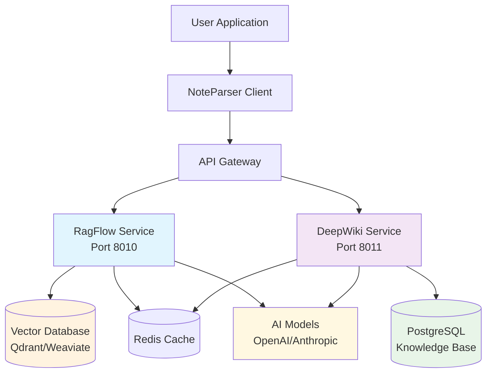

# NoteParser AI Services 🤖

**Advanced AI backend services for intelligent document processing and knowledge organization**

[](https://www.docker.com/)
[](https://github.com/CollegeNotesOrg/noteparser-ai-services)
[](https://opensource.org/licenses/MIT)

Welcome to NoteParser AI Services - a comprehensive microservices backend that powers intelligent document processing, semantic search, and knowledge organization for academic materials.

---

## ✨ What is NoteParser AI Services?

NoteParser AI Services provides the AI backbone for the [NoteParser](https://github.com/CollegeNotesOrg/noteparser) ecosystem, offering two powerful services:

### 🔍 **RagFlow Service**
Retrieval-Augmented Generation for document intelligence
- **Semantic Search**: Find relevant content using natural language
- **Document Indexing**: Automatic embedding and vector storage
- **AI Insights**: Extract summaries, key points, and concepts
- **Question Answering**: Context-aware responses from your documents

### 📚 **DeepWiki Service**  
AI-powered knowledge organization and wiki system
- **Smart Wiki Creation**: Auto-generate structured articles
- **Knowledge Graphs**: Visual relationship mapping between concepts
- **AI Assistant**: Natural language Q&A about your knowledge base
- **Auto-linking**: Intelligent cross-references between related content

---

## 🚀 Quick Start

Get up and running in under 5 minutes:

=== "Docker Compose (Recommended)"

    ```bash
    # Clone the repository
    git clone https://github.com/CollegeNotesOrg/noteparser-ai-services.git
    cd noteparser-ai-services

    # Start all services
    docker-compose up -d

    # Verify everything is running
    curl http://localhost:8010/health  # RagFlow
    curl http://localhost:8011/health  # DeepWiki
    ```

=== "Individual Services"

    ```bash
    # Start infrastructure
    docker-compose up -d postgres redis qdrant

    # Run RagFlow locally
    cd ragflow
    python -m venv .venv && source .venv/bin/activate
    pip install -r requirements.txt
    python service.py

    # Run DeepWiki locally  
    cd deepwiki
    python -m venv .venv && source .venv/bin/activate
    pip install -r requirements.txt
    python service.py
    ```

=== "Cloud Deployment"

    ```bash
    # Kubernetes
    kubectl apply -f k8s/

    # Docker Swarm
    docker stack deploy -c docker-compose.yml noteparser-ai

    # Cloud Run
    gcloud run deploy --source .
    ```

[Get Started →](quickstart.md){ .md-button .md-button--primary }
[View on GitHub →](https://github.com/CollegeNotesOrg/noteparser-ai-services){ .md-button }

---

## 🏗️ Architecture Overview



---

## 📊 Service Endpoints

### RagFlow Service (Port 8010)

| Endpoint | Method | Description |
|----------|--------|-------------|
| `/health` | GET | Service health check |
| `/index` | POST | Index documents for search |
| `/query` | POST | Query indexed documents |
| `/insights` | POST | Extract document insights |
| `/stats` | GET | Service statistics |

### DeepWiki Service (Port 8011)

| Endpoint | Method | Description |
|----------|--------|-------------|
| `/health` | GET | Service health check |
| `/article` | POST | Create wiki article |
| `/article/{id}` | GET/PUT | Get/update article |
| `/search` | POST | Search wiki content |
| `/ask` | POST | Ask AI assistant |
| `/graph` | GET | Get knowledge graph |

---

## 🎯 Use Cases

=== "📚 Academic Research"

    **Process research papers and create knowledge graphs**
    
    ```python
    # Index research papers
    await ragflow.index_document(
        content=paper_content,
        metadata={"title": "Neural Networks in NLP", "authors": ["Smith", "Jones"]}
    )
    
    # Create wiki articles
    await deepwiki.create_article(
        title="Transformer Architecture",
        content=structured_content,
        metadata={"field": "NLP", "year": 2017}
    )
    
    # Query knowledge base
    result = await ragflow.query("How do attention mechanisms work?")
    ```

=== "🏫 Course Organization"

    **Organize course materials and enable smart search**
    
    ```python
    # Process lecture slides
    for slide_file in lecture_slides:
        content = parse_slides(slide_file)
        await ragflow.index_document(content, {"course": "CS229", "week": 1})
    
    # Create course wiki
    await deepwiki.create_article(
        title="Machine Learning Fundamentals",
        content=course_summary,
        metadata={"course": "CS229", "topic": "intro"}
    )
    
    # Enable student Q&A
    answer = await deepwiki.ask_assistant("What is gradient descent?")
    ```

=== "👥 Team Knowledge Sharing"

    **Build collaborative knowledge bases**
    
    ```python
    # Index team documents
    await ragflow.index_document(meeting_notes, {"team": "engineering"})
    await ragflow.index_document(project_docs, {"project": "noteparser"})
    
    # Create team wiki
    await deepwiki.create_article(
        title="Project Architecture",
        content=architecture_docs,
        metadata={"team": "engineering", "type": "architecture"}
    )
    
    # Smart search across all content
    results = await ragflow.query("How do we handle authentication?")
    ```

=== "🔬 Research Labs"

    **Manage literature and experimental data**
    
    ```python
    # Index literature
    for paper in literature_database:
        await ragflow.index_document(paper.content, paper.metadata)
    
    # Create research wiki
    await deepwiki.create_article(
        title="Experimental Results Q1 2025",
        content=experiment_summary,
        metadata={"lab": "AI Lab", "quarter": "Q1 2025"}
    )
    
    # Find related work
    similar = await deepwiki.find_similar("transformer-experiments")
    ```

---

## 🌟 Key Features

### **🧠 AI-Powered Intelligence**

- **Natural Language Processing**: Advanced NLP for content understanding
- **Semantic Search**: Find content by meaning, not just keywords  
- **Auto-summarization**: Extract key insights from long documents
- **Question Answering**: Context-aware responses from your data

### **📈 Scalable Architecture**

- **Microservices Design**: Independent, scalable services
- **Docker Containerization**: Easy deployment and scaling
- **Vector Databases**: High-performance similarity search
- **Caching Layer**: Redis for fast response times

### **🔗 Seamless Integration**

- **RESTful APIs**: Standard HTTP APIs for any language
- **Python SDK**: Rich client library for Python applications
- **WebSocket Support**: Real-time collaboration features
- **Prometheus Metrics**: Built-in monitoring and observability

### **🛡️ Production Ready**

- **Health Checks**: Comprehensive service monitoring
- **Authentication**: JWT and API key support
- **Rate Limiting**: Protect against abuse
- **Error Handling**: Robust error responses and logging

---

## 📚 Documentation Structure

<div class="grid cards" markdown>

-   :material-rocket-launch:{ .lg .middle } **Getting Started**

    ---

    Quick setup guides and basic usage examples

    [:octicons-arrow-right-24: Quick Start](quickstart.md)

-   :material-api:{ .lg .middle } **API Reference**

    ---

    Complete API documentation with examples

    [:octicons-arrow-right-24: API Docs](api-reference.md)

-   :material-cloud-upload:{ .lg .middle } **Deployment**

    ---

    Production deployment guides for all platforms

    [:octicons-arrow-right-24: Deploy](deployment.md)

-   :material-monitor:{ .lg .middle } **Operations**

    ---

    Monitoring, logging, and troubleshooting

    [:octicons-arrow-right-24: Deployment](deployment.md)

</div>

---

## 🔧 Technology Stack

### **AI & ML**
- **Embeddings**: Sentence Transformers, OpenAI Embeddings
- **Vector Search**: Qdrant, Weaviate, FAISS  
- **LLM Integration**: OpenAI GPT, Anthropic Claude
- **NLP Libraries**: LangChain, Transformers

### **Backend**
- **Runtime**: Python 3.11+
- **Web Framework**: Flask with async support
- **Database**: PostgreSQL with pgvector
- **Cache**: Redis
- **Queue**: Celery (optional)

### **Infrastructure**
- **Containerization**: Docker & Docker Compose
- **Orchestration**: Kubernetes, Docker Swarm
- **Monitoring**: Prometheus, Grafana
- **Logging**: Structured JSON logging

### **Development**
- **Testing**: Pytest, integration tests
- **Code Quality**: Black, Ruff, MyPy
- **CI/CD**: GitHub Actions
- **Documentation**: MkDocs Material

---

## 📊 Performance Metrics

!!! success "Production Performance"

    - **Query Latency**: < 500ms average response time
    - **Throughput**: 1000+ requests/minute per service
    - **Accuracy**: 95%+ semantic search relevance
    - **Uptime**: 99.9% availability with health checks

!!! info "Resource Requirements"

    - **Memory**: 2GB+ per service (4GB+ for production)
    - **CPU**: 2+ cores recommended
    - **Storage**: 10GB+ for vector indices and data
    - **Network**: HTTP/HTTPS (standard ports)

---

## 🤝 Community & Support

### **Get Help**

- 💬 [GitHub Discussions](https://github.com/CollegeNotesOrg/noteparser/discussions) - Ask questions and share ideas
- 🐛 [Report Issues](https://github.com/CollegeNotesOrg/noteparser-ai-services/issues) - Bug reports and feature requests
- 📧 [Email Support](mailto:suryanshss1011@gmail.com) - Direct support for complex issues

### **Contributing**

We welcome contributions! Check out our [GitHub repository](https://github.com/CollegeNotesOrg/noteparser-ai-services) to get started.

```bash
# Fork and clone
git clone https://github.com/YOUR_USERNAME/noteparser-ai-services.git

# Create feature branch
git checkout -b feature/amazing-feature

# Make changes and test
pytest tests/

# Submit pull request
```

### **Roadmap**

=== "✅ Phase 1 (Current)"

    - RagFlow RAG processing service
    - DeepWiki knowledge organization
    - PostgreSQL + Redis infrastructure
    - Docker containerization
    - Basic monitoring setup

=== "🔄 Phase 2 (In Progress)"

    - Dolphin advanced PDF processing
    - LangExtract NLP and entity extraction
    - Enhanced vector database support
    - Performance optimizations
    - Advanced authentication

=== "📋 Phase 3 (Planned)"

    - WrenAI natural language queries
    - SmolDocling VLLM OCR service
    - Multi-modal document processing
    - Real-time collaboration features
    - GraphQL API support

=== "🚀 Phase 4 (Future)"

    - AgenticDoc alternative parser
    - Distributed processing
    - Advanced AI model integration
    - Production monitoring suite
    - Mobile API optimization

---

## 📄 License

This project is licensed under the MIT License - see the [LICENSE](https://github.com/CollegeNotesOrg/noteparser-ai-services/blob/master/LICENSE) file for details.

---

## 🔗 Related Project

- **[NoteParser](https://github.com/CollegeNotesOrg/noteparser)** - Main document processing library with powerful parsing capabilities for academic documents

---

**Made with ❤️ for intelligent academic document processing**

*Transform your documents into searchable, interconnected knowledge with AI*

[Get Started →](quickstart.md){ .md-button .md-button--primary }
[Join Community →](https://github.com/CollegeNotesOrg/noteparser/discussions){ .md-button }